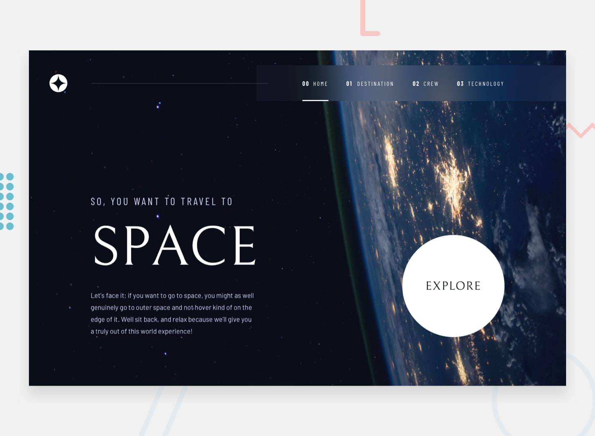

# Frontend Mentor - Space tourism website

## Welcome! 👋

[Frontend Mentor](https://www.frontendmentor.io) challenges help you improve your coding skills by building realistic projects. Our challenges are perfect portfolio pieces, so please feel free to use what you create in your portfolio to show others.

**To do this challenge, you need a strong understanding of HTML, CSS, and JavaScript.**

## The challenge

Your challenge is to build out this multi-page space tourism website and get it looking as close to the design as possible.

**This project is a collaboration between us, Scrimba, and Kevin Powell. If you'd like to see how Kevin would tackle the project, you can [follow along on Scrimba's free course](https://scrimba.com/learn/spacetravel).**

If you're working through it yourself, please use any tools you like to help you complete the challenge. So if you've got something you'd like to practice, feel free to give it a go.

If you choose to use a JS-heavy approach, we provide a local `data.json` file for the different page data. This means you'll be able to pull the data from there instead of using the separate `.html` files.

Your users should be able to:

- View the optimal layout for each of the website's pages depending on their device's screen size
- See hover states for all interactive elements on the page
- View each page and be able to toggle between the tabs to see new information

Want some support on the challenge? [Join our Slack community](https://www.frontendmentor.io/slack) and ask questions in the **#help** channel.

## Where to find everything

Your task is to build out the project to the design file provided. We provide both Sketch and Figma versions of the design, so you can choose which tool you prefer to use. You can download the design file on the platform. The design download comes with a `README.md` file as well to help you get set up.

All the required assets for this project are in the `/assets` folder. The assets are already exported for the correct screen size and optimized. Some images are reusable at multiple screen sizes.

The design system in the design file will give you more information about the various colors, fonts, and styles used in this project.

## Building your project

Feel free to use any workflow that you feel comfortable with. Below is a suggested process, but do not feel like you need to follow these steps:

1. Separate the `starter-code` from the rest of this project and rename it to something meaningful for you. Initialize the codebase as a public repository on [GitHub](https://github.com/). Creating a repo will make it easier to share your code with the community if you need help. If you're not sure how to do this, [have a read-through of this Try Git resource](https://try.github.io/).
2. Configure your repository to publish your code to a web address. This will also be useful if you need some help during a challenge as you can share the URL for your project with your repo URL. There are a number of ways to do this, and we provide some recommendations below.
3. Look through the designs to start planning out how you'll tackle the project. This step is crucial to help you think ahead for CSS classes to create reusable styles.
4. Before adding any styles, structure your content with HTML. Writing your HTML first can help focus your attention on creating well-structured content.
5. Write out the base styles for your project, including general content styles, such as `font-family` and `font-size`.
6. Start adding styles to the top of the page and work down. Only move on to the next section once you're happy you've completed the area you're working on.

## Deploying your project

As mentioned above, there are many ways to host your project for free. Our recommend hosts are:

- [GitHub Pages](https://pages.github.com/)
- [Vercel](https://vercel.com/)
- [Netlify](https://www.netlify.com/)

You can host your site using one of these solutions or any of our other trusted providers. [Read more about our recommended and trusted hosts](https://medium.com/frontend-mentor/frontend-mentor-trusted-hosting-providers-bf000dfebe).

## Create a custom `README.md`

We strongly recommend overwriting this `README.md` with a custom one. We've provided a template inside the [`README-template.md`](./README-template.md) file in this starter code.

The template provides a guide for what to add. A custom `README` will help you explain your project and reflect on your learnings. Please feel free to edit our template as much as you like.

Once you've added your information to the template, delete this file and rename the `README-template.md` file to `README.md`. That will make it show up as your repository's README file.

## Submitting your solution

Submit your solution on the platform for the rest of the community to see. Follow our ["Complete guide to submitting solutions"](https://medium.com/frontend-mentor/a-complete-guide-to-submitting-solutions-on-frontend-mentor-ac6384162248) for tips on how to do this.

Remember, if you're looking for feedback on your solution, be sure to ask questions when submitting it. The more specific and detailed you are with your questions, the higher the chance you'll get valuable feedback from the community.

## Sharing your solution

There are multiple places you can share your solution:

1. Share your solution page in the **#finished-projects** channel of the [Slack community](https://www.frontendmentor.io/slack). 
2. Tweet [@frontendmentor](https://twitter.com/frontendmentor) and mention **@frontendmentor**, including the repo and live URLs in the tweet. We'd love to take a look at what you've built and help share it around.
3. Share your solution on other social channels like LinkedIn.
4. Blog about your experience building your project. Writing about your workflow, technical choices, and talking through your code is a brilliant way to reinforce what you've learned. Great platforms to write on are [dev.to](https://dev.to/), [Hashnode](https://hashnode.com/), and [CodeNewbie](https://community.codenewbie.org/).

We provide templates to help you share your solution once you've submitted it on the platform. Please do edit them and include specific questions when you're looking for feedback.

The more specific you are with your questions the more likely it is that another member of the community will give you feedback.

## Got feedback for us?

We love receiving feedback! We're always looking to improve our challenges and our platform. So if you have anything you'd like to mention, please email hi[at]frontendmentor[dot]io.

**Have fun building!** 🚀
